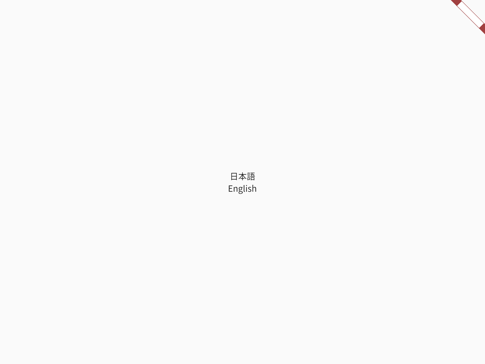

# flutter_fonts_jp

Japanese fonts for flutter apps.

### Motivation

By default, `flutter test` uses the font called Ahem that simply shows spaces, makes golden tests less valuable. `flutter_fonts_jp` provides Japanese fonts for testing.

### Usage

First, add `flutter_fonts_jp` to `dev_dependencies`:

```
# pubspec.yaml
dev_dependences:
    flutter_fonts_jp:
```

Next, make sure that `flutter.assets` in `pubspec.yaml` contains at least one file/directory. This is required to tells flutter to bundle fonts. If you app does not use any assets, add a dummy (empty) directory.

```
# pbuspec.yaml
flutter:
    assets:
        - images/
```

Lastly call `loadJapaneseFont` in tests.

```
testWidgets('golden test', (WidgetTester tester) async {
    await loadJapaneseFont();
    await tester.pumpWidget(App());
    await expectLater(find.byType(App), matchesGoldenFile('app.png'));
});
```

A golden file look something like this (it uses the real font instead of the blank one).



### Gotchas

Golden files can differ based on flutter version or platform https://github.com/flutter/flutter/issues/36667. We use linux and the latest stable flutter version for golden files.